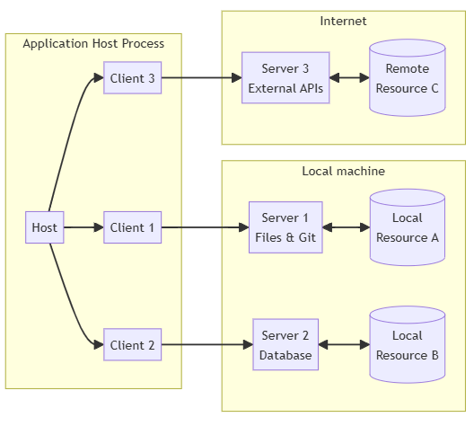

# Potencializando meu trabalho repetitivo com AI usando MCP

Uma das habilidades mais importantes de um desenvolvedor é a capacidade de analisar logs das aplicações. Visando otimizar minha rotina como desenvolvedor, criei um conjunto de ferramentas automatizadas que transformam essa processo demorado e suscetível a erros em um processo mais inteligente e dinâmico para me auxiliar e vou compartilhar um pouco do processo de desenvolvimento.


## CONTEXTO
- A pipeline do seu projeto spark começou a apresentar alguns jobs com erro, o que gerou diversos alertas para seu time e você é o encarregado de ajustar essa pipeline. Ao testar o script localmente tudo estava funcionando, mas no ambiente de produção começou a encontrar dados um pouco diferentes do que os usados para desenvolver.
- Para analisar o problema, precisa executar basicamente essa ordem de atividades:
    - Identificar o job com erro
    - Buscar o arquivo de log do processamento com o erro
    - ler o traceback de log
    - Identificar o erro
- Desenvolvimento da solução:
    - Aplicar a correção no script pyspark
    - subir versão nova com o fix

## OBJETIVO
Desenvolver um MCP Server capaz de ler e interpretar arquivos de logs (s3/Minio) do job spark que finalizou com erro.


## MCP
- O MCP é um protocolo aberto que padroniza como os aplicativos fornecem contexto para LLMs

## ARQUITETURA


- MCP Server:
  - Expor dados atraves de **Resources** 
  - Prover funcionalidades atraves de **Tools** 
  - Definir padroes de interacao atraves de **Prompts**

- MCP Client
  - interage com um ou mais servers, consumindo os Resources, Tools e Prompts disponibilizados
  - nesse exemplo não irei desenvolver um MCP Client, pois utilizaremos Claude Desktop para essa finalidade

## DESENVOLVIMENTO MCP SERVER

Eu estava desenvolvendo uma conexão manual com o storage, usando boto3, quando encontrei um exemplo de uso do s3 em um mcp server, disponibilizada pela AWS a poucos dias. Eu não curto ficar repetindo código que já existe, então apenas fiz uma adaptação [no repositorio de exemplo](https://github.com/aws-samples/sample-mcp-server-s3) para realizar a conexão com o Minio executando localmente em um docker container. 

Esse projeto conta com dois arquivos principais: `server.py` e `s3_resources.py`

### `server.py`
Disponibiliza os recursos e ferramentas criados em `s3_resources.py` através do protocolo MCP, usando `annotations`. Aqui definimos quais tools a IA será capaz de acessar:

```python
server = Server("s3_service")

@server.list_resources()
async def list_resources(start_after: Optional[str] = None) -> List[Resource]:
    ...

@server.read_resource()
async def read_resource(uri: AnyUrl) -> str:
    ...

@server.list_tools()
async def handle_list_tools() -> list[Tool]:
    return [
        Tool(
            name="list_buckets",
            description="...",
            ...
        ),
        Tool(
            name="list_objects",
            description="...",
            ...
        ),
        Tool(
            name="get_object",
            description="...",
            ...
        )
    ]

@server.call_tool()
async def handle_call_tool(
    name: str, arguments: dict | None
) -> list[TextContent | ImageContent | EmbeddedResource]:
    try:
        match name:
            case "list_buckets":
                buckets = boto3_s3_client.list_buckets(**arguments)
                return [
                    TextContent(
                        type="text",
                        text=str(buckets)
                    )
                ]
            case "list_objects_v2":
                objects = boto3_s3_client.list_objects_v2(**arguments)
                return [
                    TextContent(
                        type="text",
                        text=str(objects)
                    )
                ]
            case "get_object":
                response = boto3_s3_client.get_object(**arguments)
                file_content = response['Body'].read().decode('utf-8')
                return [
                    TextContent(
                        type="text",
                        text=str(file_content)
                    )
                ]
    except Exception as error:
        return [
            TextContent(
                type="text",
                text=f"Error: {str(error)}"
            )
        ]

async def main():
    # Run the server using stdin/stdout streams
    async with mcp.server.stdio.stdio_server() as (read_stream, write_stream):
        await server.run(
            ...
        )

if __name__ == "__main__":
    asyncio.run(main())
```

### `s3_resources.py`
Aqui definimos como os recursos e ferramentas irão interagir com o s3: 

```python
class S3Resource:

    async def list_buckets(self, start_after: Optional[str] = None) -> List[dict]:
      ...

    async def list_objects(self, bucket_name: str, prefix: str = "", max_keys: int = 1000) -> List[dict]:
      ...

    async def get_object(self, bucket_name: str, key: str, max_retries: int = 3) -> Dict[str, Any]:
      ...
```

> Como estou utilizando MinIO como storage, tive que adicionar o atributo `self.client_config` para conseguir fazer a configuração correta para utilização da ferramenta local.

### Configuração Claude Desktop

Essa foi a parte que eu mais tive problema, pois o aplicativo precisa ser reiniciado toda vez que fazia alguma alteração no server.

O Claude Desktop é compatível somente com windows e mac, precisei fazer uma configuração um pouco diferente da convencional, pois meu código está rodando em um Ubuntu no WSL:

Caso estiver executando dentro do WSL
```JSON
{
  "mcpServers": {
    "log-resource": {
      "command": "wsl",
      "args": [
        "-d",
        "Ubuntu",
        "/home/cassiogiehl/.local/bin/uv",
        "--directory",
        "/home/cassiogiehl/dev/mcp/mcp_log",
        "run",
        "server.py"
      ]
    }
  }
}
```

Com o MCP Server configurado corretamente, podemos iniciar os testes...

### Listando Buckets


### Interpretando logs de erro


### `spark-job.py` original:
```python
from pyspark.sql import SparkSession
from pyspark.sql.functions import col

# Criação de uma Spark session
spark = SparkSession.builder.appName("ErrorAnalysisExample").getOrCreate()

# Exemplo de DataFrame com duas colunas
data = [("Alice", 34), ("Bob", 45), ("Charlie", 29)]
columns = ["name", "age"]

# Criação do DataFrame
df = spark.createDataFrame(data, columns)

df.select(col("salary")).show()

# Fechamento da Spark session
spark.stop()
```
### Correção Sugerida


### Próximos passos

Agora que a LLM já tem acesso aos logs de erro e ao código do projeto, a única coisa que falta é a integração com o repositorio. Como upgrade desse projeto irei desenvolver uma solução que altera o código do job e faz o commit no git, restringindo o merge no repositório somente como minha aprovação no pull request.

## Conclusão

Neste projeto, demonstramos a integração bem-sucedida entre um servidor MCP (Model Context Protocol) e o Amazon S3 para análise de logs e correção de código. O sistema foi capaz de:

1. Acessar e listar buckets S3 contendo logs
2. Identificar erros em códigos Python através da análise dos logs
3. Sugerir correções apropriadas usando LLM (Large Language Model)

A solução provou ser eficaz para automatizar o processo de debugging, reduzindo o tempo necessário para identificar e corrigir erros em jobs Spark. A arquitetura modular permite fácil extensão para suportar outros tipos de análise e correção de código no futuro.

Disponivel em: https://github.com/cassiogiehl/mcp-log

## Fontes
- https://modelcontextprotocol.io/introduction
- https://github.com/aws-samples/sample-mcp-server-s3